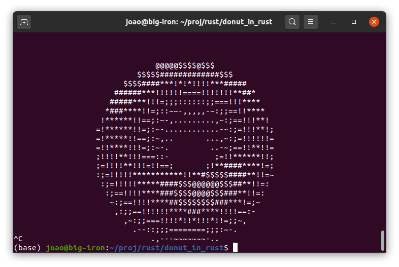
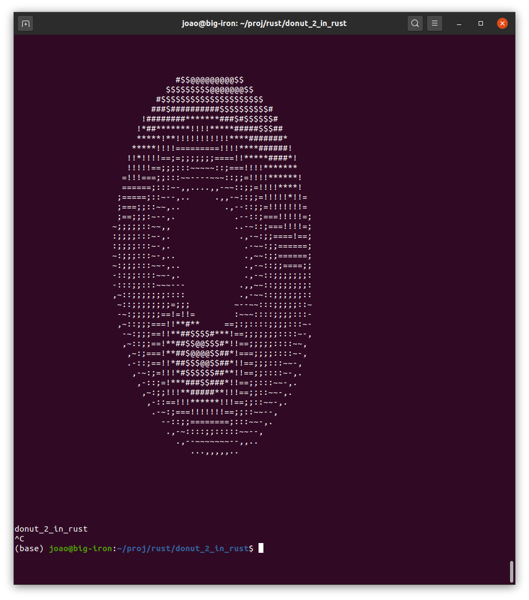

# 3D Text donut demo in Rust
A very small but elaborated and mesmerizing program written by Andy Sloane that I ported to Rust.

## Description

I have made two ports of Andy Sloane demo programs donut in C and donut in javascript to Rust, they don't produce exactly the same graphics. <br>
Andy Sloane in 2006 made the Donut little program [Have a donut - obfuscated c donut](https://www.a1k0n.net/2006/09/15/obfuscated-c-donut.html). Then in 2011, he made a blog post explaining how donut worked entitled [Donut math - how donut.c works](https://www.a1k0n.net/2011/07/20/donut-math.html) that I recommend highly that you read it to understand all the math behind the donut program.

## A screen shoot of the demo of the obfuscated C donut from 2006 ported to Rust



## A screen shoot of the demo of the Javascript donut from 2011 ported to Rust



## To see a full video of the animation see

- [Lex Fridman - Donut-shaped C code that generates a 3D spinning donut](https://www.youtube.com/watch?v=DEqXNfs_HhY)


## The original code for the obfuscated C donut from 2006 by Andy Sloane

[donut.c](orginal_donut_in_C_by_Andy%20Sloane/donut.c)

```c
             k;double sin()
         ,cos();main(){float A=
       0,B=0,i,j,z[1760];char b[
     1760];printf("\x1b[2J");for(;;
  ){memset(b,32,1760);memset(z,0,7040)
  ;for(j=0;6.28>j;j+=0.07)for(i=0;6.28
 >i;i+=0.02){float c=sin(i),d=cos(j),e=
 sin(A),f=sin(j),g=cos(A),h=d+2,D=1/(c*
 h*e+f*g+5),l=cos      (i),m=cos(B),n=s\
in(B),t=c*h*g-f*        e;int x=40+30*D*
(l*h*m-t*n),y=            12+15*D*(l*h*n
+t*m),o=x+80*y,          N=8*((f*e-c*d*g
 )*m-c*d*e-f*g-l        *d*n);if(22>y&&
 y>0&&x>0&&80>x&&D>z[o]){z[o]=D;;;b[o]=
 ".,-~:;=!*#$@"[N>0?N:0];}}/*#****!!-*/
  printf("\x1b[H");for(k=0;1761>k;k++)
   putchar(k%80?b[k]:10);A+=0.04;B+=
     0.02;}}/*****####*******!!=;:~
       ~::==!!!**********!!!==::-
         .,~~;;;========;;;:~-.
             ..,--------,*/

```

To Run it on Linux do:

```
// To compile: gcc -o donut donut.c -lm
// To run on Linux: ./donut

And because a modern computer is faster place a sleep instructions between each frame print to the screen. After A+=0.04;B+= 0.02; and before }}/*****####*******!!=;:~.

usleep(30000);

```

## The original code for the obfuscated C donut from 2006 but formatted for easier understanding

[donmut_code_formated.c](orginal_donut_in_C_by_Andy%20Sloane/donut_code_formated.c)

```c

// To compile: gcc -o donut donut_2.c -lm
// To run on Linux: ./donut

k;
double sin(), cos();

main(){
  float A=0, B=0, i, j, z[1760];
  char b[1760];
  printf("\x1b[2J");
  for( ; ; ) {
    memset(b, 32, 1760);
    memset(z, 0, 7040);
    for( j = 0; 6.28 > j; j += 0.07)
      for(i = 0; 6.28 > i; i += 0.02){
        float c = sin(i);
        float d = cos(j);
        float e = sin(A);
        float f = sin(j);
        float g = cos(A);
        float h = d + 2;
        float D = 1 / (c * h * e + f * g + 5);
        float l = cos(i);
        float m = cos(B);
        float n = sin(B);
        float t = c * h * g - f * e;
        int x = 40 + 30 * D * (l * h * m - t * n);
        int y = 12 + 15 * D * (l * h * n + t * m);
        int o = x + 80 * y;
        int N = 8 * ((f * e - c * d * g) * m - c * d * e - f * g - l * d * n);
        if (22 > y && y > 0 && x > 0 && 80 > x && D > z[o]) {
          z[o] = D;
          b[o] = ".,-~:;=!*#$@"[N > 0 ? N : 0];
        }
      } /*#****!!-*/
    printf("\x1b[H");
    for ( k = 0; 1761 > k; k++)
      putchar( k % 80 ? b[k] : 10);
    printf("donut_2_in_C\n");
    A += 0.04;
    B += 0.02;
    usleep(30000);  // This line was added.
  }
}

```

## My Rust port of the original code for the obfuscated C donut from 2006

[main.rs](donut_in_rust/main.rs)

```rust

use std::{thread, time};
use slice_fill::SliceExt;

const max_buf_size: usize = 1760;

#[warn(unstable_name_collisions)]
fn main() {
    let lux = ['.', ',', '-', '~', ':', ';', '=', '!', '*', '#', '$', '@'];

    let mut A: f32 = 0.0_f32;
    let mut B: f32 = 0.0_f32;
    let mut i: f32;
    let mut j: f32;
    let mut z: Vec<f32>  = vec![0.0; max_buf_size];
    let mut b: Vec<char> = vec![' '; max_buf_size];

    println!("\x1b[2J");

    loop {        
        b.fill(32 as char);
        z.fill(0.0);
        j = 0.0_f32;
        while 6.28_f32 > j {
            i = 0.0_f32;
            while 6.28_f32 > i {
                let c = i.sin();
                let d = j.cos();
                let e = A.sin();
                let f = j.sin();
                let g = A.cos();
                let h: f32 = d + 2.0;
                let D: f32 = 1.0 / (c * h * e + f * g + 5.0);
                let l = i.cos();
                let m = B.cos();
                let n = B.sin();
                let t: f32 = c * h * g - f * e;
                let x: i32 = (40.0 + 30.0 * D * (l * h * m - t * n)) as i32;
                let y: i32 = (12.0 + 15.0 * D * (l * h * n + t * m)) as i32;
                let o: i32 = x + 80 * y;
                let N: i32 = (8.0 * ((f * e - c * d * g) * m - c * d * e - f * g - l * d * n)) as i32;
                if (22 > y) && (y > 0) && (x > 0) && (80 > x) && (D > z[o as usize]) {
                  z[o as usize] = D;
                  b[o as usize] = lux[if N > 0 {N as usize} else { 0 }];
                }
                i += 0.02_f32;
            } /*#****!!-*/
            j += 0.07_f32;
        }
        println!("\x1b[H");
        for k in 0..max_buf_size {
            print!("{}", if k % 80 != 0 { b[k as usize] } else {10 as char});
        }
        A += 0.04;
        B += 0.02;
        thread::sleep(time::Duration::from_millis(10));
    }
}

```

[Cargo.toml](donut_in_rust/Cargo.toml)

```
[package]
name = "donut_in_rust"
version = "0.1.0"
authors = ["joao"]
edition = "2018"

# See more keys and their definitions at https://doc.rust-lang.org/cargo/reference/manifest.html

[dependencies]
slice-fill = "1.0.1"
```

## My Rust port of the Javascript code for the donut from 2011

[main.rs](donut_2_in_rust/main.rs)

```rust

use std::f32::consts::PI;
use std::{thread, time};
use slice_fill::SliceExt;

const THETA_SPACING: f32 = 0.07;
const PHI_SPACING:   f32 = 0.02;

const R1: f32 = 1.0;
const R2: f32 = 2.0; // 2.0; 
const K2: f32 = 10.0; // 5.0;

const SCREEN_WIDTH:  f32 = 80.0;
const SCREEN_HEIGHT: f32 = 50.0;

// Calculate K1 based on screen size: the maximum x-distance occurs
// roughly at the edge of the torus, which is at x=R1+R2, z=0.  we
// want that to be displaced 3/8ths of the width of the screen, which
// is 3/4th of the way from the center to the side of the screen.
// screen_width*3/8 = K1*(R1+R2)/(K2+0)
// screen_width*K2*3/(8*(R1+R2)) = K1
// const K1: f32 = SCREEN_WIDTH * K2 * 3.0 / (8.0 * (R1 + R2));

const K1: f32 = SCREEN_WIDTH * K2 * 2.0 / (8.0 * (R1 + R2));

fn lin_pos(x: usize, y: usize) -> usize {
    return y * (SCREEN_WIDTH as usize) + x; 
}

fn render_frame(a: & f32, b: & f32,
    zBuffer: & mut Vec<f32>, output: & mut Vec<char>) {

    let lux = ['.', ',', '-', '~', ':', ';', '=', '!', '*', '#', '$', '@'];

    // Pre-compute sines and cosines of A and B
    let cos_A: f32 = a.cos();
    let sin_A: f32 = a.sin();
    let cos_B: f32 = b.cos();
    let sin_B: f32 = b.sin();

    output.fill(' ');  // Space
    zBuffer.fill(0.0);

    // Theta goes around the cross-sectional circle of a torus
    let mut theta: f32 = 0.0;
    while theta < 2.0 * PI {
        // Pre-compute sines and cosines of theta
        let cos_theta: f32 = theta.cos();
        let sin_theta: f32 = theta.sin();

        // Phi goes around the center of revolution of a torus
        let mut phi: f32 = 0.0;
        while phi < 2.0 * PI {
            // Pre-compute sines and cosines of phi
            let cos_phi: f32 = phi.cos();
            let sin_phi: f32 = phi.sin();
    
            // The x,y coordinate of the circle, before revolving (factored
            // out of the above equations)
            let circle_x: f32 = R2 + R1 * cos_theta;
            let circle_y: f32 = R1 * sin_theta;

            // Final 3D (x,y,z) coordinate after rotations, directly from
            // our math above
            let x: f32 = circle_x * (cos_B * cos_phi + sin_A * sin_B * sin_phi)
                - circle_y * cos_A * sin_B; 
            let y: f32 = circle_x * (sin_B * cos_phi - sin_A * cos_B * sin_phi)
                + circle_y * cos_A * cos_B;
            let z: f32 = K2 + cos_A * circle_x * sin_phi + circle_y * sin_A;
            let ooz: f32 = 1.0 / z;  // "one over z"
      
            // x and y projection.  note that y is negated here, because y
            // goes up in 3D space but down on 2D displays.
            let xp: usize = (SCREEN_WIDTH / 2.0 + K1 * ooz * x) as usize;
            let yp: usize = (SCREEN_HEIGHT / 2.0 - K1 * ooz * y) as usize;
      
            // calculate luminance.  ugly, but correct.
            let L: f32 = cos_phi * cos_theta * sin_B - cos_A * cos_theta * sin_phi -
                sin_A * sin_theta + cos_B * (cos_A * sin_theta - cos_theta * sin_A * sin_phi);
            // L ranges from -sqrt(2) to +sqrt(2).  If it's < 0, the surface
            // is pointing away from us, so we won't bother trying to plot it.
            if L > 0.0 {
                // test against the z-buffer.  larger 1/z means the pixel is
                // closer to the viewer than what's already plotted.
                if     xp < SCREEN_WIDTH as usize 
                    && yp < SCREEN_HEIGHT as usize
                    && ooz > zBuffer[lin_pos(xp, yp)] {
                    zBuffer[lin_pos(xp, yp)] = ooz;
                    let luminance_index: usize = (L * 8.0) as usize;
                    // luminance_index is now in the range 0..11 (8*sqrt(2) = 11.3)
                    // now we lookup the character corresponding to the
                    // luminance and plot it in our output:
                    output[lin_pos(xp, yp)] = lux[luminance_index];
                }
            }
            phi += PHI_SPACING;
        }
        theta += THETA_SPACING;
    }

    // now, dump output[] to the screen.
    // bring cursor to "home" location, in just about any currently-used
    // terminal emulation mode
    print!("\x1b[H");
    for j in 0..SCREEN_HEIGHT as usize {
        for i in 0..SCREEN_WIDTH as usize {
            print!("{}", output[lin_pos(i,j)]);
        }
        print!("\n");
    }
}


#[warn(unstable_name_collisions)]
fn main() {
    let mut a: f32 = 0.0_f32;
    let mut b: f32 = 0.0_f32;

    let mut zBuffer: Vec<f32>  = vec![0.0; (SCREEN_WIDTH * SCREEN_HEIGHT) as usize];
    let mut output:  Vec<char> = vec![' '; (SCREEN_WIDTH * SCREEN_HEIGHT) as usize];

    println!("\x1b[2J");
    loop {
        render_frame(& a, & b, & mut zBuffer, & mut output);
        println!("donut_2_in_rust");
        a += 0.04;
        b += 0.02;
        thread::sleep(time::Duration::from_millis(10)); // 10
    }
}

```

[Cargo.toml](donut_2_in_rust/Cargo.toml)

```

[package]
name = "donut_2_in_rust"
version = "0.1.0"
authors = ["joao"]
edition = "2018"

# See more keys and their definitions at https://doc.rust-lang.org/cargo/reference/manifest.html

[dependencies]
slice-fill = "1.0.1"

```

## References
- [Donut math - how donut.c works](https://www.a1k0n.net/2011/07/20/donut-math.html)
- [Have a donut - obfuscated c donut](https://www.a1k0n.net/2006/09/15/obfuscated-c-donut.html)
- [Lex Fridman - Donut-shaped C code that generates a 3D spinning donut](https://www.youtube.com/watch?v=DEqXNfs_HhY)
- [The Rust programming language](https://www.rust-lang.org/)
- [The Rust book](https://doc.rust-lang.org/book/)

## License
For my part of the port is MIT Open License but the original code in C and in Javascript doesn't have a license written, that i could find.

## Have fun!
Best regards, <br>
Joao Nuno Carvalho
